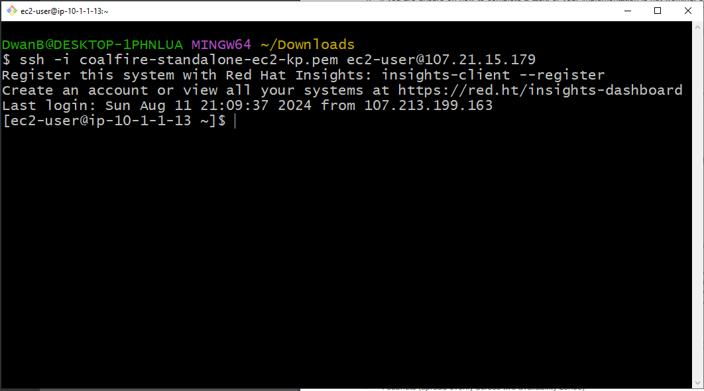

# AWS POC Challenge Terraform Repo

## Overview

This document describes the solution for setting up a proof-of-concept (PoC) environment on AWS using Terraform. The infrastructure is designed to be scalable, secure, and automated, following best practices for cloud deployment. The key components include a Virtual Private Cloud (VPC), EC2 instances, an Auto Scaling Group (ASG), an Application Load Balancer (ALB), S3 buckets, IAM roles, and Security Groups.

## Architecture Overview

The architecture consists of the following components:

- *1 VPC* with a CIDR block of 10.1.0.0/16.
- *4 Subnets* distributed across two Availability Zones:
  - *Sub1 (10.1.0.0/24)* and *Sub2 (10.1.1.0/24)* are public subnets accessible from the internet.
  - *Sub3 (10.1.2.0/24)* and *Sub4 (10.1.3.0/24)* are private subnets, not accessible from the internet.
- *1 EC2 instance* in Sub2 running Red Hat Linux with 20 GB storage, configured as a web server.
- *1 Auto Scaling Group (ASG)* spread across Sub3 and Sub4, running Red Hat Linux with 20 GB storage, with an HTTPD installation script.
- *1 Application Load Balancer (ALB)* that listens on TCP port 80 and forwards traffic to the ASG on port 443.
- *2 S3 Buckets*:
  - *Images* bucket with a folder named archive and a Memes folder that moves objects older than 90 days to Glacier.
  - *Logs* bucket with two folders:
    - *Active*: Moves objects older than 90 days to Glacier.
    - *Inactive*: Deletes objects older than 90 days.
  - However the folders itself are not created.
- *IAM Roles*:
  - An IAM role for ASG instances to read from the images S3 bucket.
  - An IAM role for all EC2 instances to write logs to the logs S3 bucket.
- *Security Groups* configured to allow necessary traffic for HTTP, HTTPS, and SSH access.

## Standalone EC2 Login Screenshot

## Testing and Validation

### 1. VPC and Subnets
- Verified that the VPC and subnets were created with the correct CIDR blocks and routing configurations.
- Confirmed public and private subnets' accessibility according to the design.

### 2. EC2 Instance in Sub2
- Successfully SSH'ed into the EC2 instance in Sub2 using its public IP.

### 3. Auto Scaling Group (ASG) and Application Load Balancer (ALB)
- No testing has been done here. The ALB returns "502 Gateway not found"

### 4. S3 Buckets and IAM Roles
- No testing done

## References

- [Terraform AWS Provider Documentation](https://registry.terraform.io/providers/hashicorp/aws/latest/docs)
- [AWS S3 Lifecycle Policies](https://docs.aws.amazon.com/AmazonS3/latest/userguide/object-lifecycle-mgmt.html)
- [Terraform Best Practices](https://www.terraform.io/docs/cloud/guides/best-practices.html)

## Conclusion

This proof-of-concept environment demonstrates the ability to create a scalable, secure, and automated infrastructure on AWS using Terraform. The setup adheres to cloud best practices, providing a robust foundation for further development and production deployment.